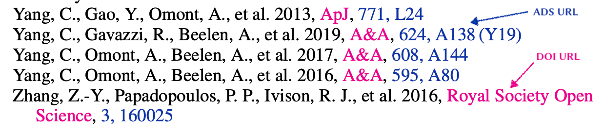

# A&A-bibstyle-with-hyperlink
- modified `aa.bst` with clickable url links in the bibliography
- bst file for Astronomy & Astrophysical Journal
- modified based on the `aa.bst` file from http://ftp.edpsciences.org/pub/aa/readme.html
- it is recommended to **use the bibtex record generated from NASA/ADS** in order to include `doi` and `adsurl` properly

## See an example below

